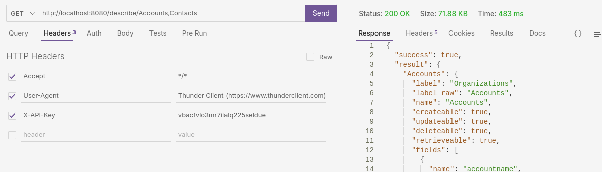

# coreBOS REST API

coreBOS REST API is an EvolutivoFW/coreBOS addon which allows to communicate with your application using a REST API. It is an implementation of a RESTful API on top of coreBOS web service API.

## Installation

### Get the code and configure

- clone the project into some directory in your server
- Configure access: edit `.env` and set the URL to the EvolutivoFW/coreBOS installation you want to access
- start the server

### Start the API application

#### Apache

- configure your DNS for the domain URL you want to access the API on
- create an apache virtual host for your domain that accesses the public driectory in the project

```
<VirtualHost *:8080>
	ServerName cbrestapi.domain.tld
	DocumentRoot "/path/to/restapiproject/app/public"

	<Directory "/path/to/restapiproject/app/public">
		Require all granted
		AllowOverride All
	</Directory>
</VirtualHost>
```

#### Docker

Note that this is not recommended for production, you must use Caddy, Nginx or Apache.

- `docker build -t cbrestapi .`
- `docker run -d --rm --name cbrestapi -p 8080:80 cbrestapi`

#### PHP (not recommended for production)

- `cd app`
- `php -S localhost:8080 -t public/`

## Usage

You can easily communicate with your application using the REST protocol.

- **GET:** 
	- Authentificate a user
	- Retrieve an entity or a list of entities
	- Retrieve meta information
	- Search/Query the application
	- others...
- **POST:**
  - Add an entity
- **PATCH:** 
  - Update an entity
- **DELETE:** 
  - Remove an entity

### Authentification (GET)

To communicate with your application you must be authenticated. To retrieve the authentication token you must execute this call:

`http://yourapplication.tld/auth/USER/PASSWORD`

Where you must replace `USER` with the user login name and `PASSWORD` with the user password or access key that you can find in the user preferences page. Access key is preffered and tried first.

**Result:**

```
{"success":true,"result":"f7171f3d8e13326762a45641c2dd1e39"}

//Token: f7171f3d8e13326762a45641c2dd1e39
```

**You must use the generated token in all other calls.** It must be passed as the header parameter `X-API-Key`. Note that if you have a Credentials Web Service Token you can use it directly in the `X-API-Key` header with no need to do the login process. This will look something like this:



### Retrieve Meta Information (GET)

You can retrieve the list of accessible modules using the `listtypes` endpoint and all the information of a module using the `describe` endpoint.

- `http://yourapplication.tld/listtypes`
- `http://yourapplication.tld/describe/Accounts`
- `http://yourapplication.tld/describe/Accounts,Contacts`

### Query/Search records (GET)

Execute a web service query

`http://yourapplication.tld/query/web_service_query`


### Retrieve data (GET)

In the following examples I use the Accounts module, but you can use the API with all modules.

#### Get entities list (GET)

`http://yourapplication.tld/Accounts`

#### Retrieve entity by ID (GET)

In the following example we retrieve the account with ID = 74. Note that any of the supported IDs (CRMID, WebService ID and cbuuid) are accepted.

`http://yourapplication.tld/Accounts/74`

### Create entity (POST)

To create a new entity you must at least specify the mandatory fields of the module. It is not mandatory to add all other fields. To specify a field you must use its fieldname, which can be obtained using the Describe meta information endpoint.

`http://yourapplication.tld/Accounts`

Data to post in body:

```json
{
	"accountname": "MediaToolBox",
	"email1": "mediatoolbox@yopmail.tld",
	"phone": "+33656896325",
	"bill_street": "100 street beta test\r\nBat. B",
	"bill_code": "34000",
	"bill_city": "Montpellier",
	"bill_country": "France"
}
```

### Update entity (PATCH)

To update an entity you must specify its ID and the fields values you want to update. To specify a field you must use its fieldname, which can be obtained using the Describe meta information.

`http://yourapplication.tld/Accounts`

Data to post in body:

```json
{
	"id": "11x56",
	"email1": "newemail@yopmail.tld",
	"phone": "+33999666333",
}
```

### Delete entity (DELETE)

To remove an entity you must specify its ID.

`http://yourapplication.tld/Accounts/25`

### Mass Retrieve (GET)

Retrieve a whole set of records in one call

`http://yourapplication.tld/mass/retrieve/{ids}`

For example, `http://localhost:8080/mass/retrieve/1084,1092` Note that all the IDs must belong to the same module.

### Mass Delete (DELETE)

Delete a whole set of records in one call

`http://yourapplication.tld/mass/delete/{ids}`

For example, `http://localhost:8080/mass/delete/1084,1092`

```json
{
  "success": true,
  "result": {
    "success_deletes": [
      "12x1084",
      "12x1092"
    ],
    "failed_deletes": []
  }
}
```

## Future tasks

There are a lot of things we can add. More operations from our web service API, paging on the query and list, custom API endpoints, ... but this project defines the path of how (officialy) we will support a RESTful API on top of all the awesome functionality EvolutivoFW and coreBOS provide!
